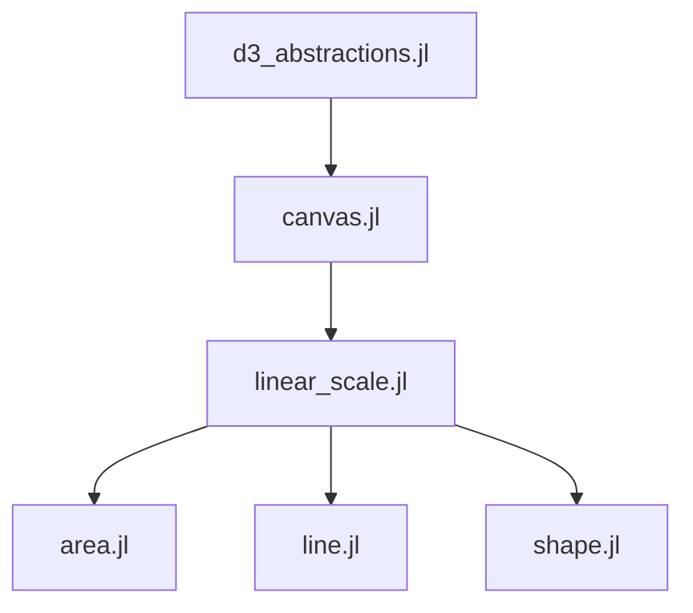

# Portinari.jl

A Julian abstraction for D3 to be run inside of Pluto! Still in its early stages.

## Small demo

https://user-images.githubusercontent.com/23220288/156614523-f4a6a2f0-a0a8-46d6-a43b-5d7c2f64227f.mp4

# Features

- Lines
- Areas
- Shapes (scatter)
- Pluto hooked events

# Notebook Hierarchy

