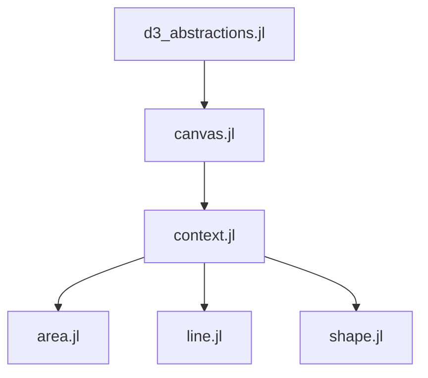

# Portinari.jl

A Julian abstraction for D3 to be run inside of Pluto! Still in its early stages.

## Small demo

https://user-images.githubusercontent.com/23220288/161279567-6ab6a7b8-3ee0-404b-b003-8da99022045a.mp4

# Features

- Lines
- Areas
- Shapes (scatter)
- Pluto hooked events

# Notebook Hierarchy

